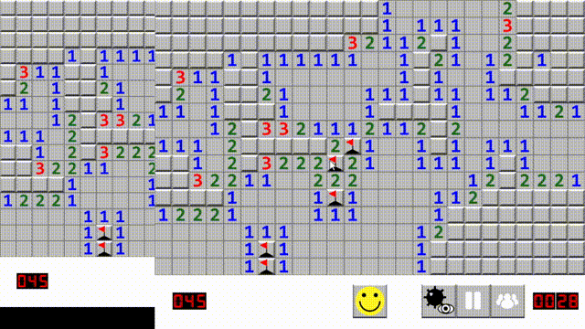

# Minesweeper

A fully-featured Minesweeper clone built in C++ using SFML 2.5.1.



## Features
- Configurable board size and mine count via `config.cfg`
- Real-time mine counter and timer
- Leaderboard with top 5 fastest wins
- Debug mode to reveal all mines
- Pause/resume functionality
- Recursive tile reveal for empty cells

## Tech Stack
- C++17
- SFML 2.5.1 (graphics, window, audio)
- CMake

## Building
### Prerequisites
- GCC 8.1.0+ (MinGW-W64)
- SFML 2.5.1
- CMake 3.5+

### Steps
```bash
mkdir build
cd build
cmake .. -G "MinGW Makefiles" -DSFML_DIR="path/to/SFML-2.5.1/lib/cmake/SFML"
cmake --build .
```

## Configuration
Edit `config.cfg` to change board settings:
```
25   # columns
16   # rows
50   # mines
```